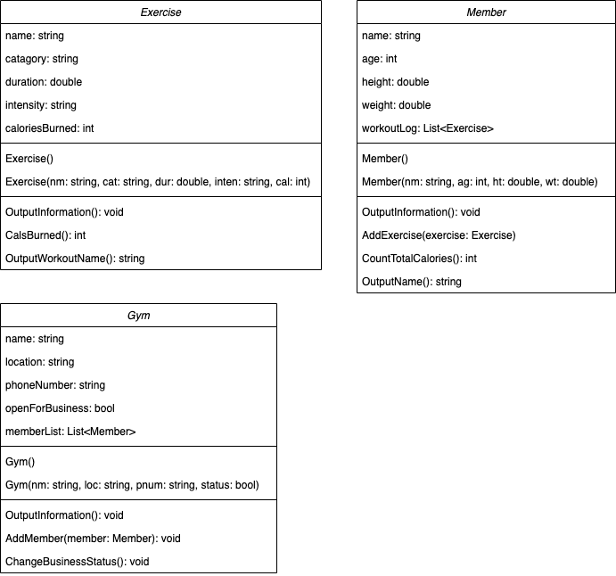

# is350 final project

## stage 1
I will create an application for a gym to manage its members by tracking their exercise routines. The program will manage the gym business, its members, and the exercises they perform in the gym. Members can sign up for a gym membership (no tiers) and perform exercises. The gym business can be open or closed, depending on user input.

## stage 2

## stage 3
### Exercise
`name`: string that identifies individual exercises

`category`: string that identifies the category of the exercise (e.g., cardio, warm-up, etc.)

`duration`: int that measures the minutes the exercises lasts

`intensity`: string that describes how "hard" it went

`caloriesBurned`: int measuring the calories burned during the exercise

`OutputInformation()`: outputs the variables

`CalsBurned()`: returns caloriesBurned as an int

`OutputWorkoutName()`: returns name as string

### Member
`name`: string that identifies individual members

`age`: int that represents the member's age

`height`: int that measures their height in feet

`weight`: int, but for weight in pounds

`workoutLog`: list of exercises the member does

`OutputInformation()`: outputs the variables

`AddExercise(exercise)`: adds exercise object to list

`CountTotalCalories()`: sums the calorie values of member's exercises and outputs it

`OutputName()`: returns name as string

### Gym
`name`: string that identifies individual gyms

`location`: string that identifies the location (city, state) of gym

`phoneNumber`: string containing the phone number of gym

`openForBusiness`: bool defining if gym is open or closed

`memberList`: list of gym members

`OutputInformation()`: outputs the variables

`AddMember(member)`: adds member object to list

`ChangeBusinessStatus()`: toggles openForBusiness

## stage 4
check `Program.cs`